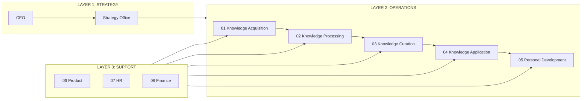

# Value Chain — SecondBrain Co.

**Phiên bản:** 1.0
**Ngày:** 2026-05-15

---

## Porter Value Chain (3 Layers)

```
┌─────────────────────────────────────────────────────────────────────────┐
│  LAYER 1: STRATEGY                                                       │
│  ┌──────────────┐  ┌──────────────┐  ┌─────────────────────────┐        │
│  │    CEO       │→ │   Research   │→ │    Strategy Office      │        │
│  └──────────────┘  └──────────────┘  └─────────────────────────┘        │
│  Output: Vision, Annual Plan, Budget, Knowledge Strategy                 │
├─────────────────────────────────────────────────────────────────────────┤
│  LAYER 2: OPERATIONS (Primary Activities — Knowledge Value Chain)         │
│                                                                           │
│  ┌──────────────┐  ┌──────────────┐  ┌──────────────┐                   │
│  │  01-KNOWLEDGE│→ │  02-KNOWLEDGE│→ │  03-KNOWLEDGE│                   │
│  │  ACQUISITION │  │  PROCESSING  │  │  CURATION    │                   │
│  │              │  │              │  │              │                   │
│  │ • Capture    │  │ • Analyze    │  │ • Organize   │                   │
│  │ • Curate     │  │ • Extract    │  │ • Tag & Link │                   │
│  │ • Import     │  │   Gems       │  │ • Review &   │                   │
│  │              │  │ • Synthesize │  │   Prune      │                   │
│  └──────────────┘  └──────────────┘  └──────┬───────┘                   │
│                                              │                           │
│                                              ↓                           │
│                          ┌──────────────┐  ┌──────────────┐             │
│                          │  04-KNOWLEDGE│→ │  05-PERSONAL │             │
│                          │  APPLICATION │  │  DEVELOPMENT │             │
│                          │              │  │              │             │
│                          │ • Apply to   │  │ • Set Goals  │             │
│                          │   Project    │  │ • Track      │             │
│                          │ • Create     │  │   Progress   │             │
│                          │   Deliverable│  │ • Reflect    │             │
│                          │ • Transfer   │  │              │             │
│                          └──────────────┘  └──────────────┘             │
│                                                                          │
│  Knowledge Flow:                                                         │
│  Raw Info → Curated Input → Insights/Gems → Organized Vault →           │
│  Applied Knowledge → Personal Growth                                     │
├─────────────────────────────────────────────────────────────────────────┤
│  LAYER 3: SUPPORT                                                        │
│  ┌──────────┐  ┌──────────┐  ┌──────────┐                               │
│  │ 06-PROD  │  │ 07-HR    │  │ 08-FINAN │                               │
│  │ (Platform│  │ (People  │  │ (Finance │                               │
│  │  & Tools)│  │  & Cult) │  │  & Ops)  │                               │
│  └──────────┘  └──────────┘  └──────────┘                               │
│  ↑ Hỗ trợ tất cả Layer 2 activities ↑                                   │
└─────────────────────────────────────────────────────────────────────────┘
```

## Mermaid Diagram



## Inter-Department Dependencies

| From | To | Data/Artifact | SOP |
|------|----|--------------|-----|
| Knowledge Acquisition | Knowledge Processing | Raw captured notes, URLs, snippets | SOP-KA-003 → SOP-KP-001 |
| Knowledge Processing | Knowledge Curation | Processed insights, gems, summaries | SOP-KP-003 → SOP-KC-001 |
| Knowledge Curation | Knowledge Application | Vault entries, tagged knowledge | SOP-KC-002 → SOP-KAPP-001 |
| Knowledge Application | Personal Development | Applied outcomes, lessons learned | SOP-KAPP-003 → SOP-PD-002 |
| Personal Development | Knowledge Acquisition | Learning goals, new topics to explore | SOP-PD-001 → SOP-KA-002 |

> **Key Insight:** Đây là vòng lặp khép kín (feedback loop): Personal Development liên tục feed ngược lại Knowledge Acquisition để định hướng thu thập tri thức tiếp theo.
